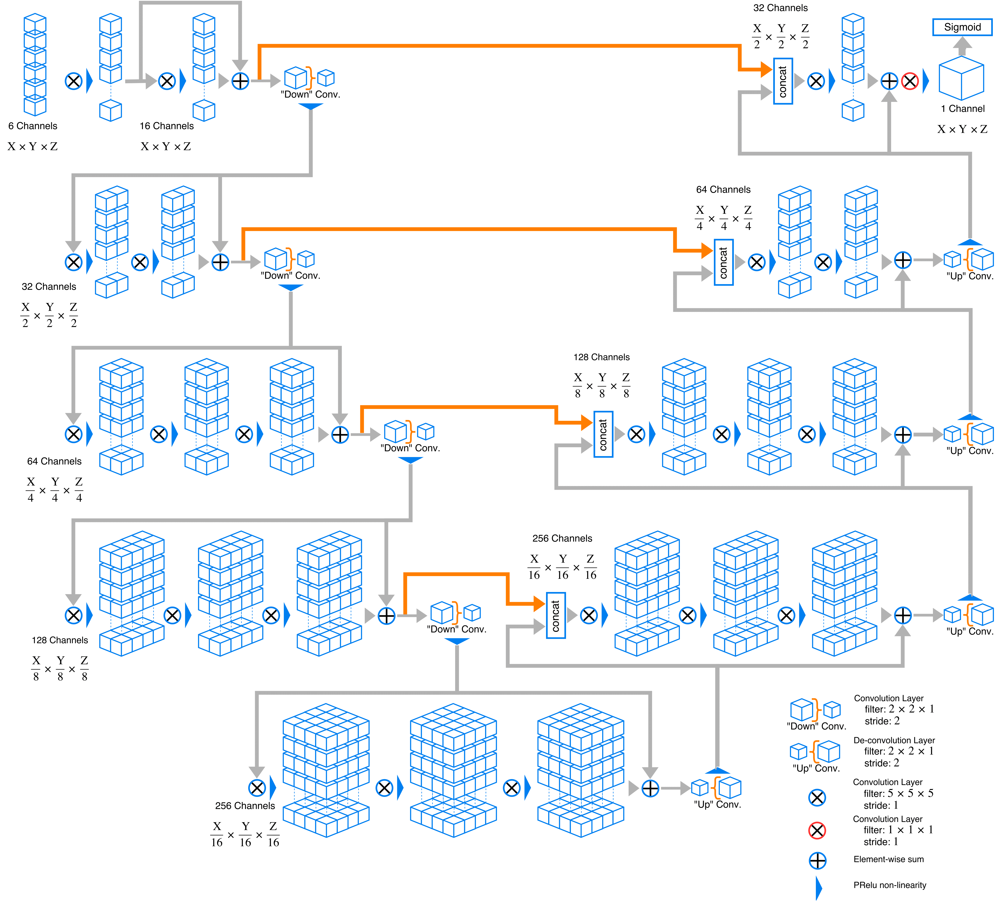

### Tensorflow implementation of  V-Net

This is a Tensorflow implementation of the ["V-Net"](https://arxiv.org/abs/1606.04797) architecture used for 3D medical 
imaging segmentation.
This code only implements the Tensorflow graph, it must be used within a training program.

### Visual Representation of the Network

This is an example of a network this code implements.



### Example Usage

```
from VNet import VNet

input_channels = 6
num_classes = 1

tf_input = tf.placeholder(dtype=tf.float32, shape=(10, 190, 190, 20, input_channels))

model = VNet(num_classes=num_classes, keep_prob=.7)

logits = model.network_fn(tf_input, is_training=True)

```

`logits` will have shape `[10, 190, 190, 20, 1]`, it can the be flattened and used in the sigmoid cross entropy function.


### How to use

1. Instantiate a `VNet` class. The only mandatory argument is the number of output classes/channels. 
The default arguments of the class implement the network as in the paper. However, the implementation is flexible and by
looking at the `VNet` class docstring you can change the network architecture.

2. Call the method `network_fn` to get the output of the network. The input of `network_fn` is a tensor with shape 
`[batch_size, x, y, z, ..., input_channels]` which can have as many spatial dimensions as wanted. The output of 
`network_fn` will have shape `[batch_size, x, y, z, ..., num_classes]`. 


##### Notes

In a binary segmentation problem you could use `num_classes=1` with a sigmoid loss and in a three class
problem you could use `num_classes=3` with a softmax loss.


### Implementation details

The `VNet` class with default parameters implements the network as is in the
 [original paper]((https://arxiv.org/abs/1606.04797)) but with a bit more flexibility in the number of input and output 
 channels:
1. The input can have more than one channel. If the input has more than one channel than one more convolution is added 
before the input to increase the input number of channels to match `n_channels`. If the input has only one channel then 
it is broadcasted in the first skip connection (repeated ``n_channel` times).
2. The output does not need to have two channels like in the original architecture.

The `VNEt` class can be instantiated with following arguments

* `num_classes`: Number of output classes.
* `keep_prob`: Dropout keep probability, set to 1.0 if not training or if no dropout is desired.
* `num_channels`: The number of output channels in the first level, this will be doubled every level.
* `num_levels`: The number of levels in the encoder and decoder of the network. Default is 4 as in the paper.
* `num_convolutions`: An array with the number of convolutions at each level, i.e. if `num_convolutions = (1, 3, 4, 5)` 
then the third level of the encoder and decoder will have 4 convolutions.
* `bottom_convolutions`: The number of convolutions at the bottom level of the network. Must be given separately because 
of the odd symmetry of the network.
* `activation_fn`: The activation function. Defaults to relu, however there is prelu implementation in this code.


